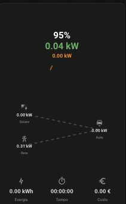

# EV Charge Flow Card

A Home Assistant Lovelace card for an EV charging session: a rotating power
gauge (wallbox draw vs. what actually reaches the battery), an energy-flow
diagram (where that power is coming from) and a small stats grid. One card,
drop it anywhere, point it at whatever entities you already have.

It doesn't assume any particular brand of wallbox or car: every value is an
entity you choose in the config, and the card quietly hides whatever part it
can't compute from what you've given it. Power sensors are read in whatever
unit they report (W or kW) — no need to convert anything yourself.

> 🚧 **Early days.** Gauge, stats, energy-flow and the visual editor exist
> so far (see [Roadmap](#roadmap)); only `controls` is still a no-op —
> accepted in config, so it keeps working once it lands, but invisible
> until then.

## Screenshot



## Installation

### HACS

Not yet in HACS's default list (see [Roadmap](#roadmap)), so add it as a
custom repository for now:

1. HACS → the three-dot menu → **Custom repositories** → paste
   `https://github.com/hubcasale/ev-charge-flow-card`, category
   **Dashboard**.
2. Install **EV Charge Flow Card**. HACS registers the resource for you.
3. Add the card to a dashboard (see [Configuration](#configuration)).

### Manual

1. Copy `dist/ev-charge-flow-card.js` to `<config>/www/ev-charge-flow-card.js`.
2. Settings → Dashboards → Resources → add
   `/local/ev-charge-flow-card.js` as a **JavaScript Module**.
3. Reload the dashboard.

## Configuration

```yaml
type: custom:ev-charge-flow-card
entities:
  # Power the wallbox is drawing from the grid.
  wallbox_power: sensor.my_wallbox_power
  # Wallbox's rated ceiling: a literal number in watts, or an entity id
  # (read live) if your wallbox exposes its configured max current/power.
  wallbox_max: 7400
  # Power actually reaching the car's battery, if your car integration
  # reports it (accepts W or kW — read from the entity's own unit).
  battery_power: sensor.my_car_charge_power
  # Car's state of charge, in %.
  battery_soc: sensor.my_car_battery
  # Car's preset charge limit, in % — a literal number or an entity id.
  # Marked on the SOC ring as a bold yellow tick, if set.
  charge_limit: sensor.my_car_charge_limit
  session_energy: sensor.my_wallbox_session_energy
  session_time: sensor.my_wallbox_session_time
  session_cost: sensor.my_wallbox_session_cost # or omit and set a price instead:
  energy_cost_per_kwh: 0.22
  # Used by the energy-flow module — all optional, add whichever you have.
  grid_power: sensor.my_grid_power
  solar_power: sensor.my_solar_power
  home_battery_power: sensor.my_home_battery_power
modules:
  - type: gauge
    enabled: true
  - type: energy_flow
    enabled: true
  - type: stats
    enabled: true
  - type: controls # not implemented yet — accepted, has no effect
    enabled: false
```

Every key under `entities` is optional. With only `wallbox_power` set you
get a single ring and one number; add the rest as you have them.

`modules` is an **ordered** list — the order you write is the order the
card renders top to bottom — with an `enabled` flag per entry. Use the
visual editor (Edit dashboard → this card → the pencil icon) to pick every
entity from a dropdown and reorder/enable modules with the up/down arrows
and a switch, rather than writing this YAML by hand — up/down instead of
drag-and-drop, for reliability across mouse, trackpad and touch alike.

### The gauge, briefly

Three concentric rings. The outermost (green) is the battery's state of
charge — a clock-face fill, 12 o'clock is 0%, sweeping clockwise to 100%,
static (no spin), with a tick every 10% and a pointer + label at the
current value. If `charge_limit` is set, it's marked with a bold yellow
tick of its own. The middle (orange) and inner (yellow) rings are the
wallbox draw and what's actually reaching the battery: each an arc whose
length is `power / wallbox_max` (a full circle at max power). Both spin
clockwise, in phase, at one shared speed (driven by wallbox power) — so
their tails stay together as they rotate and the gap between how far each
reaches stays readable throughout the spin, not just when stopped; that
gap is, visually, the conversion loss between the two. Centre reads, top
to bottom: battery %, power reaching the battery (big), wallbox power and
the resulting efficiency % (small).

### The stats grid, briefly

Up to three tiles — energy, duration, cost — each shown only if it can be
computed. Cost comes straight from `session_cost` if you have that sensor;
otherwise, given `session_energy` and `energy_cost_per_kwh` (a literal price
or an entity — a `input_number` you adjust by hand works fine), the card
multiplies them itself. The currency symbol follows `hass.config.currency`.

### The energy-flow diagram, briefly

Up to three sources on the left — solar, grid, home battery, whichever you
configure — each with a dashed line to the car on the right, `wallbox_power`
strength again. Dashes flow left-to-right (into the car) and move faster
with more power, same visual language as the gauge. A home battery is the
one two-way case: negative power (charging, by the common HA convention)
reverses its dashes to flow *into* the battery instead. No entity
configured beyond `wallbox_power`? Just the car shows, no lines — and with
one source, the line centres instead of trying to look like three.

This is a small, purpose-built diagram — straight lines, no curves, no
home-wide accounting for what solar/grid/battery are doing outside this
charging session. For a full home-energy Sankey, use
[power-flow-card-plus](https://github.com/flixlix/power-flow-card-plus)
instead; this module isn't trying to replace it.

## Roadmap

- [x] Gauge module
- [x] Stats module (session energy / time / cost tiles)
- [x] Visual config editor (entity pickers, enable/reorder modules)
- [x] Energy-flow module (solar/grid/home-battery → car, built from
      scratch — no dependency on another custom card)
- [x] Installable as a HACS custom repository (passes `hacs/action`
      validation, tagged releases)
- [ ] Accepted into HACS's default repository list (so it shows up in
      HACS search without adding this repo's URL by hand first)

## Development

```bash
npm install
npm run build      # -> dist/ev-charge-flow-card.js
```

`dev/index.html` is a small standalone harness (sliders driving a mock
`hass`) for checking the gauge visually without a real Home Assistant
instance — serve the repo root with any static file server and open
`dev/index.html`. It isn't part of the published card.

## License

MIT — see [LICENSE](LICENSE).
